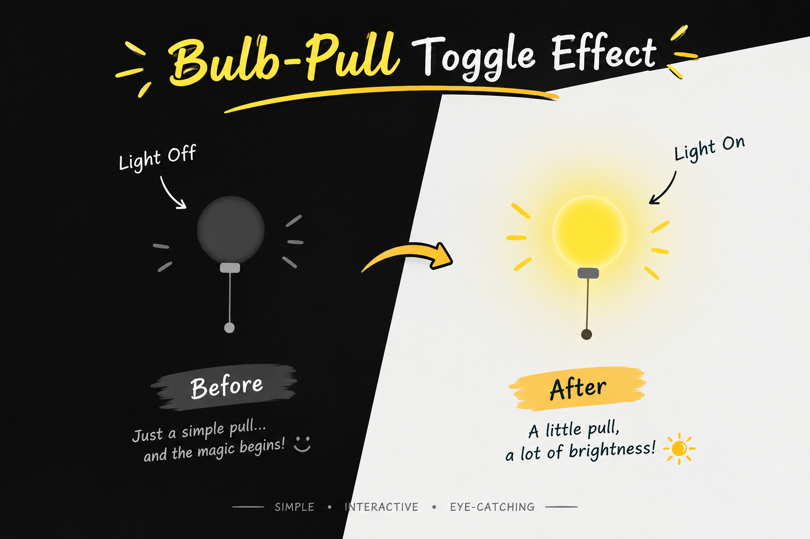

# 💡 Creative Bulb Toggle

  <strong>Interactive Hanging Bulb Web Effect</strong>

  A tiny interactive web experiment exploring how simple interactions, thoughtful animation, and a little code can bring an idea to life.

---

## ✨ About The Project

**Creative Bulb Toggle** is a small interactive web experiment built around a simple idea:

  
### *Pull the cord. Change the light.*

The project combines **HTML, CSS and JavaScript** to create a hanging bulb with an interactive pull-cord, glowing light effect and smooth movement.

It is a simple concept designed to explore how small details and interactions can make a webpage feel more alive.

> 💡 *"Sometimes, all it takes is a little pull to switch on a bright idea."*

---

## 🌟 Features

| | Feature |
|---|---|
| 💡 | **Interactive Hanging Bulb** |
| 🧵 | **Pull-Cord Toggle Interaction** |
| ⚡ | **Smooth Spring-Style Animation** |
| ✨ | **Glowing ON/OFF Light Effect** |
| 🎨 | **Clean & Minimal Interface** |
| 📱 | **Responsive Layout** |
| 🪶 | **Lightweight & Framework-Free** |

---

## 🛠️ Built With

  

 

| Technology | Purpose |
|------------|---------|
| 🟧 **HTML5** | Page structure |
| 🟦 **CSS3** | Styling, animation & visual effects |
| 🟨 **JavaScript** | Interaction & toggle logic |

---

## 🎯 The Idea Behind It

> *"A simple interaction can turn a static page into an experience."*

**Pull → Move → Toggle → Glow**

The goal was not to build something complicated, but to experiment with:

- Interactive UI behaviour
- CSS-based visual effects
- Animation timing
- JavaScript event handling
- Minimal web design

---

## ✦ Behind The Code

Designed, developed, and maintained with ❤️ by **Anwesha**  

*• © 2026 Bulb • Pull the Cord, Light the Code •*

